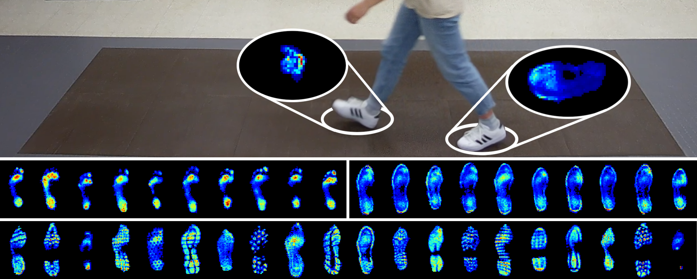

<h1 align="center">UNB StepUP-P150</h1>
<p align="center"><i>A comprehensive dataset of underfoot pressures for gait analysis and recognition</i></p>

<p align="center">
  
</p>

# Overview
StepUP-P150 is a dataset of dynamic underfoot pressures during walking, developed to support pressure-based gait analysis and recognition. It contains high-resolution pressure recordings from 150 participants walking across a sensor-embedded platform at four different speeds (preferred speed, slow, fast, and slow-to-stop) with four different footwear conditions (barefoot, standard sneakers, and two pairs of personal shoes). 

The StepUP-P150 dataset can be downloaded from our [Figshare Repository](https://doi.org/10.6084/m9.figshare.28143686). The dataset is provided in both `.npz` (i.e., NumPy) and `.mat` (i.e., MATLAB) file formats for convenience.

This repository contains Python and MATLAB code to support dataset use. The codes were developed for Python Version 3.11 and MATLAB Version 2023a. A comprehensive overview of the dataset and methodology is provided in [our paper](www.google.com).

# Using the Repository

Refer to the [`matlab`](matlab) folder for MATLAB code for loading the data. Refer to the [`python`](python) folder for Python data loading utilities and Jupyter Notebooks with examples for gait feature extraction, visualisation, and data preprocessing. You will need to update the `dataset_folder` variable (line 3 of `utils.m`, line 5 of `utils.py`) with the file path to the dataset in your local environment.

Python dependencies are documented in the `requirements.txt` file. Install them with the following command:

```bash
pip install -r requirements.txt
```

# Data Records

Each participant completed a series of sixteen 90-second walking trials (i.e., four walking speeds $\times$ four footwear conditions). They also completed twelve 30-second balance trials (i.e., three balance tasks $\times$ four footwear conditions). The dataset folder structure organizes the different trials using the following IDs:

<i>Standing and Walking Conditions</i>

| ID | Description | 
| --- | --- |
| W1 | Preferred Speed Walking |
| W2 | Slow-to-Stop Walking| 
| W3 | Slower than Preferred Walking |
| W4 | Faster than Preferred Walking | 
| S1 | Balancing on Both Feet | 
| S2 | Balancing on Left Foot |
| S3 | Balancing on Right Foot | 

<i>Footwear Conditions</i>

| ID | Description | 
| --- | --- |
| BF | Without Footwear (Barefoot or Sockfoot) |
| ST | Standard Sneakers (Adidas Grand Court 2.0) | 
| P1 | Participant's First Pair of Personal Footwear |
| P2 | Participant's Second Pair of Personal Footwear | 

## Walking Trials

For each walking trial (W1, W2, W3, W3), the following data files are provided: 

1. `metadata.csv`: labels, 3D bounding boxes, and parameters extracted during processing for each footstep that occurred in the 90-second trial. A full description of metadata fields is provided in Table 5 of [our paper](www.google.com).

1. `trial.{npz,mat}`: a 3D tensor containing the full 90-second pressure recording recording with shape: (approx. 9000 frames $\times$ 720 px $\times$ 240 px)

1. `pipeline_1.{npz,mat}`: a 4D tensor containing extracted footsteps preprocessed using *pipeline #1* (documented in [our paper](www.google.com) and demonstrated in [normalized_footsteps.ipynb](python/normalized_footsteps.ipynb)) with shape: (n<sub>footsteps</sub> $\times$ 101 frames $\times$ 75 px $\times$ 40 px)

1. `pipeline_2.{npz,mat}`: a 4D tensor containing extracted footsteps preprocessed using *pipeline #2* (documented in [our paper](www.google.com) and demonstrated in [normalized_footsteps.ipynb](python/normalized_footsteps.ipynb)) with shape: (n<sub>footsteps</sub> $\times$ 101 frames $\times$ 75 px $\times$ 40 px)

   
## Balance Trials

For each balance trial (S1, S2, S3), the following data files are provided:

1. `trial.{npz,mat}`: a 3D tensor of the full 30-second trial recording, with shape: (approx. 3000 frames $\times$ 720 px $\times$ 240 px)
1. `processed.{npz,mat}`: a 3D array spatially cropped to the region of interest, with shape: (3000 frames $\times$ 180 px $\times$ 180 px)


# Citing this Dataset

```bibtex
The dataset descriptor is currently under review in Scientific Data. A DOI and citation details will be updated once available.
```
